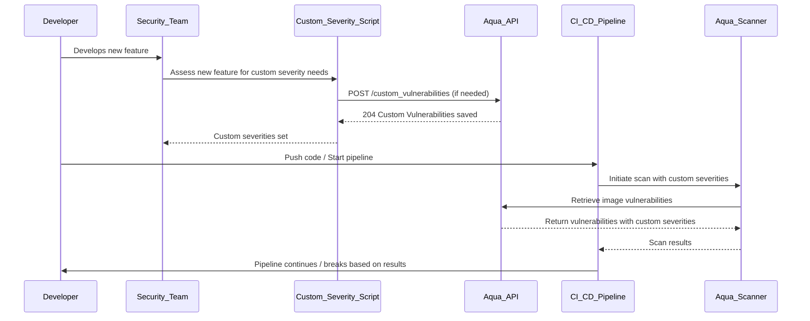

# Shift-Left Security Practices

## Overview

This document outlines the best practices for integrating security early into the software development life cycle (
SDLC). By 'shifting left', we address security issues early, reduce risks and minimize the impact on the deployment
pipeline..

## Custom Vulnerability Severity via Aqua Security API

### When to Set Custom Severities

Custom severities should be set when:

1. A vulnerability is identified that requires a severity level adjustment based on the specific context of our
   environment.
2. New features are developed, and preliminary security assessments suggest the standard severity ratings do not apply.
3. Changes in the application's architecture or exposure (e.g., no longer being web-facing) alter the impact of a known
   vulnerability.
4. Regular scheduled reviews of vulnerabilities indicate a change in the threat landscape or risk profile.
5. A new threat intelligence suggests a different severity level is more appropriate.

### API Usage Example

Below is an example of how to use the Aqua's API can set a custom vulnerability severity:

```python
import requests

# Set the API endpoint
url = "https://aqua_security_api_endpoint/custom_vulnerabilities"

# Prepare the headers and data payload
headers = {
    'Authorization': 'Bearer YOUR_API_TOKEN',
    'Content-Type': 'application/json'
}
data = {
    "custom_vulnerabilities": [
        {
            "cve": "CVE-XXXX-XXXX",
            "severity": "medium",
            "notes": "The application is not web-facing, reducing the risk of exploitation."
        }
    ]
}

# Make the POST request to the Aqua Security API
response = requests.post(url, headers=headers, json=data)

# Check the response
if response.status_code == 204:
    print("Custom vulnerabilities saved successfully.")
else:
    print("Failed to set custom vulnerabilities. Response:", response.text)
```

Replace `YOUR_API_TOKEN` and `https://aqua_security_api_endpoint` with the appropriate token and API endpoint for your
Aqua Security instance.

## Reasons to Reduce Vulnerability Severity

1. Not Web-Facing: If a vulnerability is exploitable only through web access and the application is not web-facing, its
   risk is significantly reduced.
1. Compensating Controls: Additional security controls in place may mitigate the risk of a vulnerability being
   exploited.
1. Isolated Network: The application operates on an isolated network without direct access from potentially malicious
   sources.
1. Lack of Exploitability: There may be no known exploits for a vulnerability, or it requires complex conditions to
   exploit that are not present in our environment.
1. Business Context: The affected system may not be mission-critical, or the data it handles might not be sensitive,
   reducing the potential impact.

## Visualization of the Process



The sequence diagram describes the process of setting custom vulnerability severities within a CI/CD pipeline integrated
with Aqua Security. Here's a point-by-point rundown of the process as depicted in the diagram:

**Development Phase:**

* The developer works on new features in the development environment and commits code to the repository.

**Security Assessment:**

* The security team reviews the new features for potential vulnerabilities. This can be done via a static scan.

**Custom Severity Assessment:**

* If the security team determines that a vulnerability's standard severity rating does not accurately reflect its impact
  in the specific environment (e.g., the application is not web-facing), they decide to set a custom severity.

**API Call to Set Custom Severity:**

* The security team uses a custom severity script to send a POST request to the Aqua Security API at the
  /custom_vulnerabilities endpoint. The request includes the CVE ID, the new severity level, and notes justifying the
  change.

**Aqua API Response:**

* The Aqua API processes the request and, if successful, responds with a 204 status code, indicating that the custom
  vulnerability severities have been saved.

**CI/CD Pipeline Initiation:**

* The developer initiates the CI/CD pipeline by pushing code to the repository, which triggers the pipeline process.

**Aqua Security Scan:**

* The CI/CD pipeline includes a step to run an Aqua Security scan on the codebase or container image. The scan uses the
  custom severity levels set earlier for any applicable vulnerabilities.

**Vulnerability Scan Results:**

* The Aqua scanner retrieves the image vulnerabilities, including those with custom severities, and provides the scan
  results to the CI/CD pipeline.

**Pipeline Decision:**

* Based on the results from the Aqua scanner, the CI/CD pipeline continues if the vulnerabilities are within acceptable
  risk levels, or it breaks (fails) if critical vulnerabilities are found.

**Developer Notification:**

* The developer is informed of the pipeline's outcome. If the pipeline continued, deployment proceeds. If it broke, the
  developer must address the reported vulnerabilities.
* This process emphasizes the importance of integrating security early in the development lifecycle and ensuring that
  vulnerability severity ratings are accurate and reflect the actual risk to the organization. By setting custom
  severities before the CI/CD pipeline runs, teams can avoid disruptions due to overestimated vulnerabilities and focus
  on genuinely critical issues that require immediate attention.

## Pipeline Integration Example

To integrate a job in your GitHub Actions workflow that sets custom vulnerability severities before running the
aqua_scan job, you can add a step that executes an API call to Aqua's /custom_vulnerabilities endpoint.

Here is an example of how to define this new job within your existing workflow:

```yaml
jobs:
  set_custom_severity:
    runs-on: ubuntu-latest
    outputs:
      custom_severity_set: ${{ steps.set_severity.outputs.result }}
    steps:
      - name: Checkout code
        uses: actions/checkout@v2
      - name: Set Custom Vulnerability Severity in Aqua
        id: set_severity
        run: |
          # Define variables
          AQUA_API="https://aqua_security_api_endpoint"
          TOKEN="${{ secrets.AQUA_API_TOKEN }}"
          HEADER="Authorization: Bearer $TOKEN"
          CONTENT_TYPE="Content-Type: application/json"
          DATA='{"custom_vulnerabilities": [{"cve": "CVE-XXXX-XXXX", "severity": "medium", "notes": "The application is not web-facing, reducing the risk of exploitation."}]}'
          
          # Make the API call to set custom severities
          RESPONSE=$(curl -s -o response.txt -w "%{http_code}" -X POST "$AQUA_API/custom_vulnerabilities" -H "$HEADER" -H "$CONTENT_TYPE" -d "$DATA")
          
          # Check the response
          if [ "$RESPONSE" -ne 204 ]; then
            echo "Failed to set custom vulnerabilities. Response code: $RESPONSE"
            echo "Response body:"
            cat response.txt
            exit 1
          fi

          # Output the result
          echo "::set-output name=result::true"
        env:
          AQUA_API_TOKEN: ${{ secrets.AQUA_API_TOKEN }}

 
  aqua_scan:
    runs-on: ubuntu-latest
    needs: build_image
    # ... rest of the aqua_scan job as defined ...

```

**This set_custom_severity job does the following:**

* **Checkouts the code:** Ensures the workflow has the latest version of the repository.
* **Sets Custom Vulnerability Severity:** Uses a curl command to make a POST request to the Aqua Security API, setting a
  custom severity for a specified vulnerability.
* **Checks the Response:** Evaluates the HTTP status code returned by the API call. If it's not 204, the job fails and
  prints the response body for debugging.
* **Outputs the Result:** Sets a job output variable custom_severity_set to true if the API call succeeds. This is used
  as a condition for running subsequent jobs.
* Replace https://aqua_security_api_endpoint with your actual Aqua API endpoint, and CVE-XXXX-XXXX with the actual CVE
  ID you're setting a custom severity for. The AQUA_API_TOKEN should be stored as a secret in your GitHub repository's
  settings.

This job should be run before the build_image and aqua_scan jobs to ensure that the custom severities are set before
Aqua scans the images. The subsequent jobs are conditional on the success of setting the custom severity.